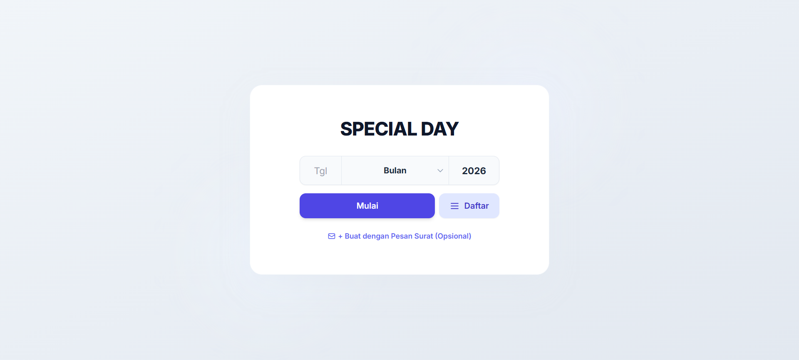
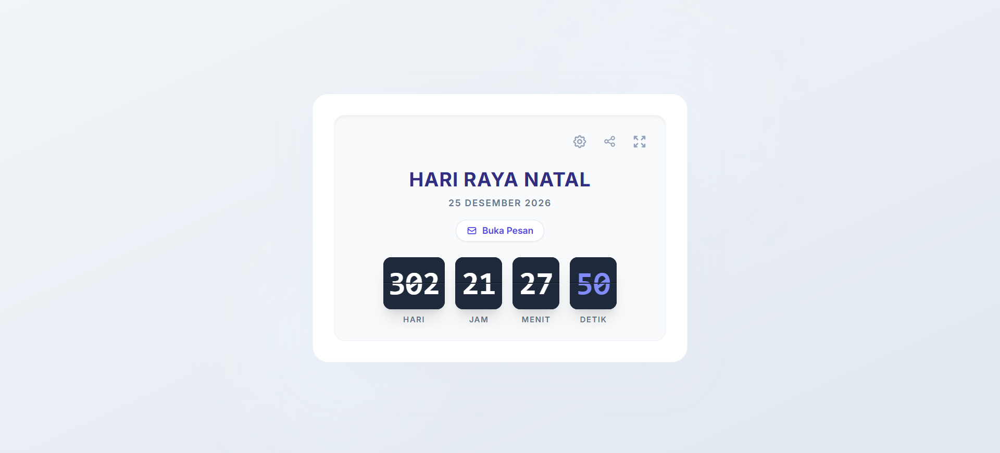
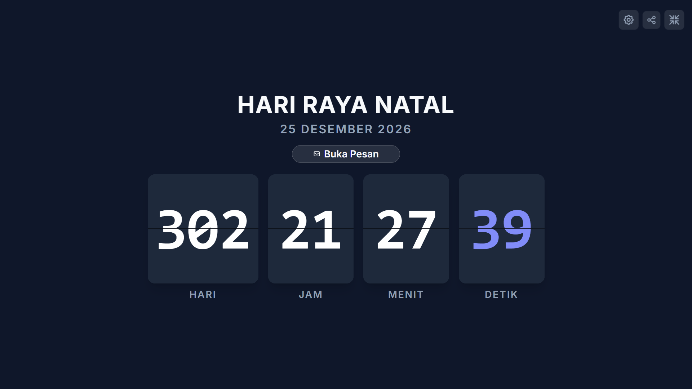

# 🎉 Special Day Countdown (Web App)

A modern, elegant, and highly interactive web-based countdown timer designed to help you anticipate your special moments. Featuring 3D flip card animations, a shareable custom message system, and a stunning fullscreen mode.

## ✨ Key Features

* **3D Flip Card Animation:** Smooth and realistic mechanical flip card effects for the countdown timer.
* **Shareable Link & Personal Message:** Create a countdown with a custom title, sender, receiver, and a heartfelt message. Generate a unique link to share with loved ones.
* **Immersive Fullscreen Mode:** A distraction-free, beautifully scaled theater mode. On mobile devices, it automatically forces a landscape orientation for the best viewing experience.
* **Smart Event Directory:** Includes a built-in searchable list of Indonesian national holidays and special dates. Selecting an event automatically sets the countdown title.
* **Persistent Memory (Local Storage):** The app remembers your last countdown and custom messages even after you close the browser. No login required.
* **Celebration Confetti:** Triggers a joyful confetti animation when the countdown reaches zero.
* **Responsive & Adaptive:** Fully responsive design that looks perfect on both desktop monitors and mobile screens.

## 💻 Application Preview


*Home page.*


*Countdown page.*


*Full screen page.*

## 🛠️ Tech Stack

The main technologies used in this project include:

* **Frontend:**
    * HTML5
    * Tailwind CSS
    * Vanilla JavaScript (ES6+)
    * [Canvas-confetti](https://github.com/catdad/canvas-confetti) (for celebration effects)

*This is a client-side only application and does not require a backend or database.*

## ⚙️ Installation & Setup

Follow these steps to get the project running on your local machine:

1.  **Clone this repository:**
    ```bash
    git clone https://github.com/fandipres/special-day.git
    cd special-day
    ```

2.  **Run the application:**
    
    No special installation is needed. Simply open the `index.html` file in your web browser.
    ```bash
    # On Windows
    start index.html

    # On macOS
    open index.html
    ```

3.  The application should now be running in your browser.

## 🔗 Links

* **Live Demo:** [fandipres.github.io/special-day](https://fandipres.github.io/special-day)
* **Repository:** [github.com/fandipres/special-day](https://github.com/fandipres/special-day)

## 📄 License

This project is licensed under the [MIT License](https://opensource.org/licenses/MIT).